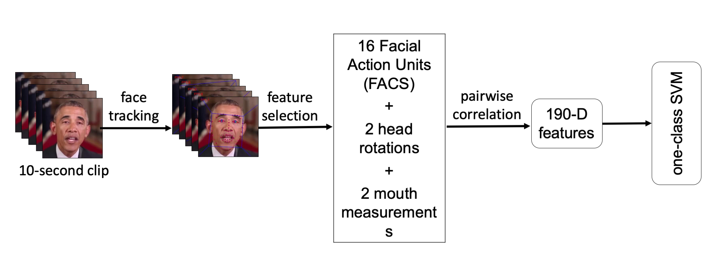

# berkeley-poi

Person of Interest (POI) DeepFake Detection

## Overview

We describe a forensic technique that models facial expressions and movements that typify an individual's speaking pattern. Although not visually apparent, these correlations are often violated by the nature of how deep-fake videos are created and can, therefore, be used for authentication.

## Dependencies

Requirements:

<ul>
    <li> Path to OpenFace build/bin folder. This folder is created after OpenFace compilation. Please follow the instructions given <a href="https://github.com/TadasBaltrusaitis/OpenFace/wiki">here</a> to compile OpenFace2.0 on your machine. Kepp the binaries in OpenFace folder.
    <li> This code has been tested on Python3.6. The python dependencies can be installed using requirements.txt. 
</ul>

## Files

train.ipynb --> training pipeline
test.ipynb --> testing pipeline
utils.py --> utility functions needed for training and testing
models --> the SVM models for 5 POIs in our paper paper.pdf. Download it from https://www.dropbox.com/sh/xrdm85je800jozd/AAC_SP1kCFSyQpoyvTDVs6-qa?dl=0
test_ex --> some example test videos. Download it from https://www.dropbox.com/sh/bftai1drcflvf5d/AACfwQDwGPEU8kYy4lZM0NZCa?dl=0

## Dataset

Links for training the models for 5 POI are given in folder video_links.

Each video used for the training and testing should comply with the following criteria. Currently, video cleaning is performed manually. In future, we can automate this process. 

<ul>
	<li> saved in .mp4 format,
	<li> saved at 30 fps,
	<li> length of the video should be more than 10 seconds,
	<li> POI should be present and talking in the entire sequence,
	<li> only POI face should be present in the video,
	<li> POI should be mainly looking towards the camera and not moving the head too far left, right, top or bottom,
	<li> camera is not moving too much (rotating/zooming/cuts)
</ul>
